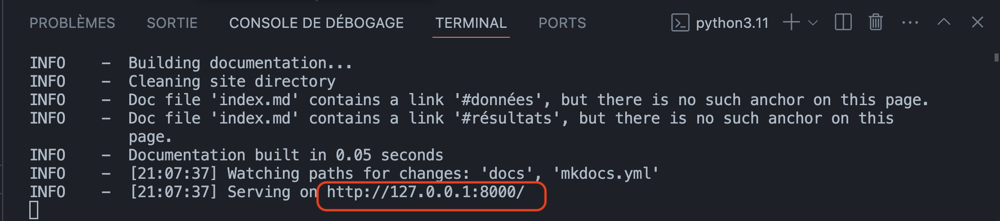

## Clone the project
1. Open your terminal from the directory of your choice.
2. Clone the project by executing the following command:
   
```bash
  git clone https://github.com/GaRyFoYDev/honeymoon.git
```
## Create a Virtual environment
1. Open your terminal from the cloned project directory.
2. Set up your virtual environment by executing the command: 

```bash
  python -m venv .venv
```

## Install Project Dependencies
1. Open your terminal from the cloned project directory.
2. Activate your virtual environment by typing the command:

```bash
  source .venv/bin/activate
```

3. Install the required dependencies by executing the command:
   
```bash
  pip install -r requirements.txt
```

## Documentation
1. You can access the documentation in the docs folder of the project.
2. Alternatively, you can view the documentation by running the following command in your terminal from the project directory:

```bash
  mkdocs serve
```
3. Once the server is running, navigate to the documentation page. 
   
   
 


